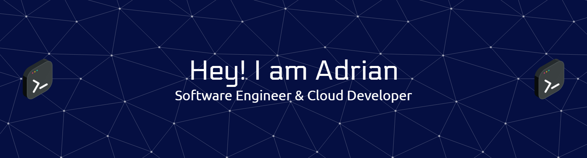

<!-- Banner (puedes cambiar el link por el tuyo propio) -->

  

<h1 align="center">👋 Hi, I'm Adrián Angulo</h1>

  

  <b>Passionate Software Engineer | Lifelong Learner | Tech Enthusiast</b>

---

## 👨‍💻 Meet the Developer

- 🚀 I’m a software developer based in Cartagena - Colombia.
- 💡 I love building useful tools, learning new tech, and collaborating on open-source projects.
- 🤓 Always eager to face new challenges and help others grow.
- 🌱 Currently learning: DevOps, Cloud
- 🗣️ Languages: English, Spanish

  
  
  
  

---

## ✨ Highlights

  
  
  

---

## 🛠️ Areas of Expertise

### Programming Languages

  
  
  
  

### Frontend Development

  
  
  
  

### Backend Development

  
  
  
  

### Software & Tools

  
  
  
  
  
  

### Operating Systems

  
  
  

### Frameworks & Libraries

  
  
  

---

## 📈 GitHub Stats

  
  

  

  

---

## 📣 Let's Connect!

  <em>Open to exciting projects, collaborations, and networking! Feel free to reach out 🚀</em>

